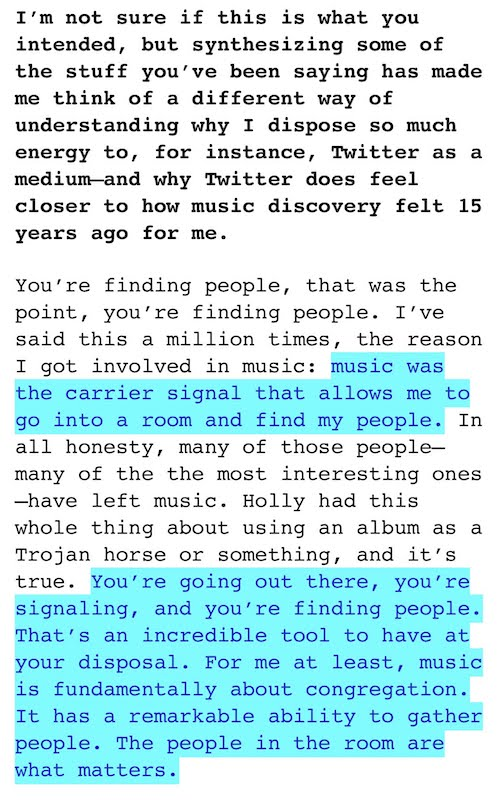

# sharing things

Feb 27, 2019 - 1:18 AM

realizing that to some extent that i share things, not to seem "smart" or to signal anything specific, but because i feel some innate need to externalize as much of my consciousness and thought as possible

this feeling seems almost like a survival instanct in ways i don't have all the words to explain... for one thing, it feels like profound thoughts aren't worth having if they aren't externalized somehow, feels like a gross disservice to myself otherwise

i've tweeted in the past about how the internet/computers could be what helps us live forever. the internet presents something of a though-sensitive film onto which all that which flows through out minds can be impressed upon for all eternity.

i've also been thinking a lot about the idea of signaling, especially as it relates to finding community by exposing one's thoughts and feelings. i haven't quite found the words to externalize my thoughts on this but there's a good [mat dryhurst interview](https://thecreativeindependent.com/people/philosopher-and-digital-artist-mat-dryhurst-on-redesigning-the-system/) that does a much better job than i could on this (screenshotted excerpt below)

