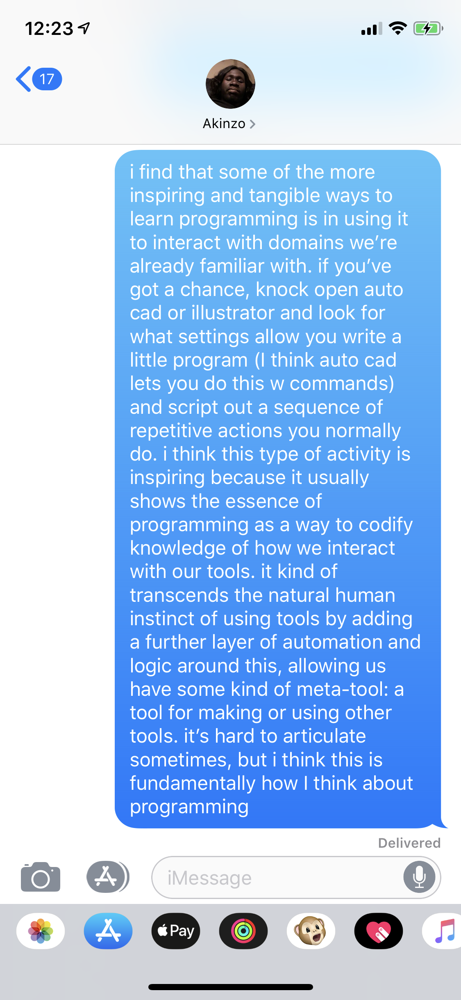

# Programming as a Meta-tool

In many ways, we can think about computer platforms and applications as tools built upon other tools. The whole essence of the stack of platforms and protocols we have is tools on which other tools can be built that, themselves were built on tools. It’s often important when analyzing platforms and applications to understand what their relative position in the stack is and the immediate and/or essential neighbors (i.e. if platform/protocol A wasn’t below in the stack of application B, would it matter? e.g. webapps require HTTP but don’t directly depend on the software architecture of the client device, browser serves as an *abstracting platform* in this case)
