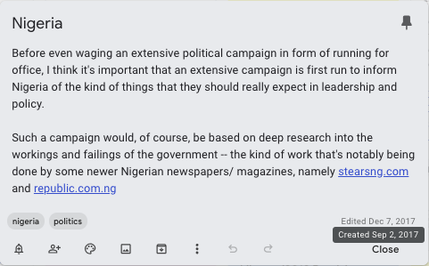

# understanding money and power in nigeria

Dec 03, 2018

"understanding the flow of money (national revenue/expenditure) is useless outside of the context of power structures through which it flows"

I've been fascinated for a long time with two projects by nigerian techies: [yourbudgit.ng](http://yourbudgit.ng) and [tracka.ng](http://tracka.ng), both spearheaded by Olusegun Onigbinde. BudgIT provides detailed analyses of budgets put out by various arms of the Nigerian government, and Tracka analyzes and crowdsources feedback on public projects in the country. These projects championed an ideal of education and radical transparency on the state of the nation. 

a google keep note i wrote over a year ago

Both these projects fit into ideas i've had around providing detailed exposure to the country's electorate on issues that affect them. But i've long felt that there are some missing pieces in their approach which i summarized in the opening quote. 

I propose a tool, in form of a graph of all indivduals within the nigerian political system that is annotated with revenue/expenditure data from both BudgIT and Tracka. I think this could help better illuminate the power structures in our system and give a more thorough education to the electorate.
